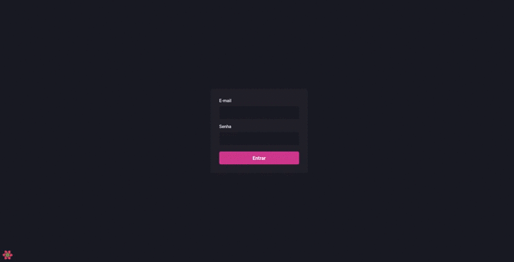

# 📚 Dashgo

 * Projeto desenvolvido pela rockseat. A ideia é desenvolver um site de automação do zero, usando o layout do figma juntamento com o ChakraUi para seu desenvolvimento.

  

# 🖥 Tecnologias utilizadas no projeto

✅ ChakraUI - Criação da interface

✅ React Apexcharts - Usado para graficos

✅ React Query - Armazenar os dados nos cookies

✅ React Hook Forms - Obter os dados do formulario

✅ Yup - Validar os formularios

✅ React Icons - Icones usados na aplicação
 
  

# 🧑‍💻 Densenvolvimento das telas

✔ SignIn

✔ Dashboard

✔ Usuario

✖️ Automação - Formularios 

 

# Instalação

~~~html
# Copie e cole no seu terminal 

$ git clone 
~~~

~~~html
# Acesse a pasta
$ cd "nome_da_pasta"

# Execute o comando
$ yarn dev

# Acessa pelo  browser 
$ https://localhost:3000
~~~

 

